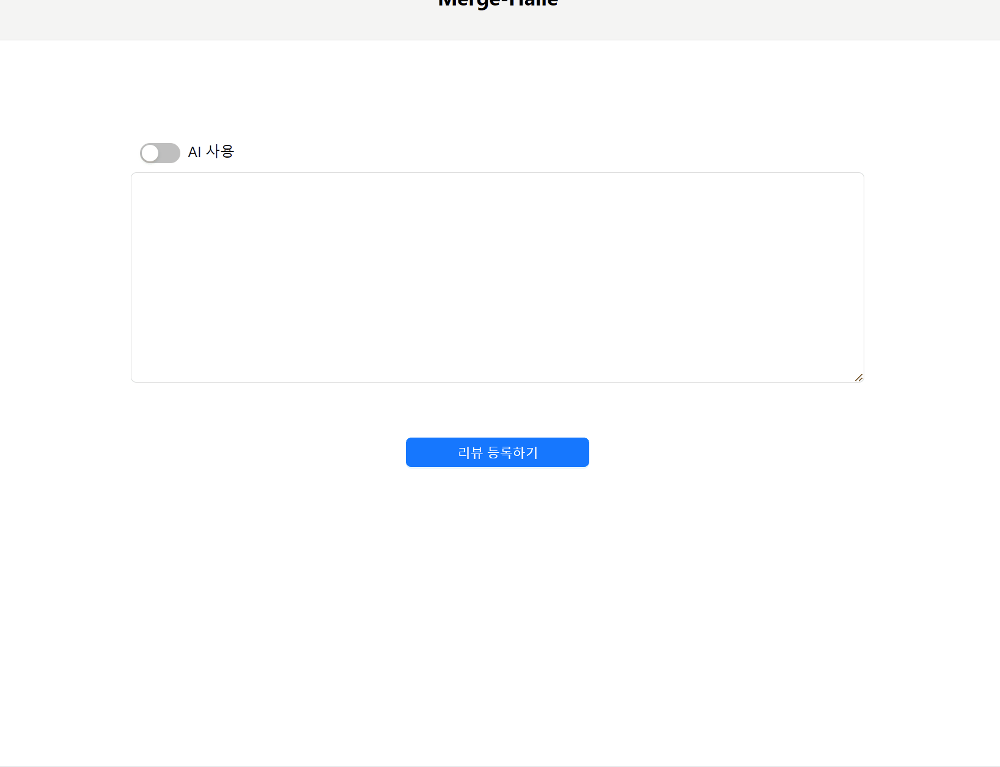
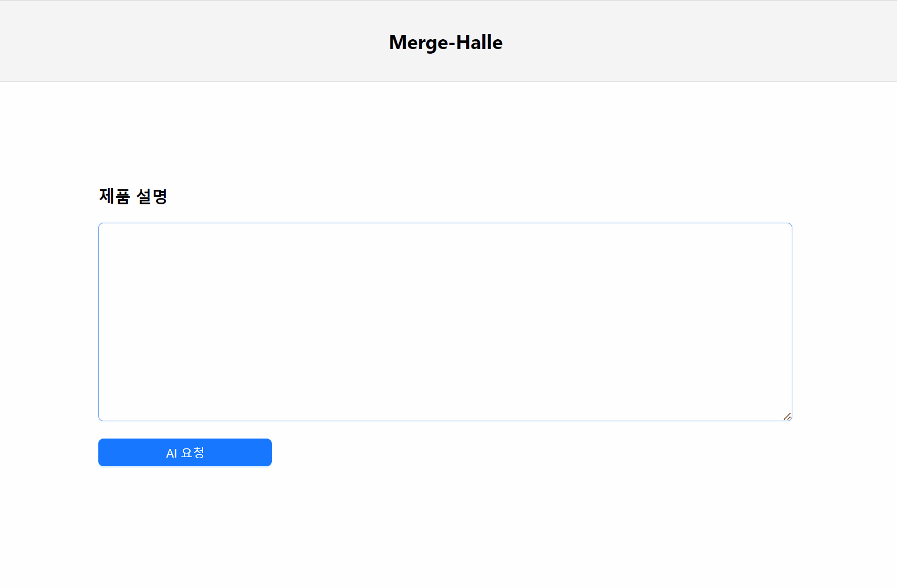

# Review Halle

## Table of Contents

[1. Introduce](#introduce)  
[2. What I Did](#what-i-did)  
[3. Team](#team)  
[4. View](#view)  

## Introduce
이 프로젝트는 리뷰 품질 개선을 통한 마케팅도우미 "리뷰 할래?" 서비스입니다.  
2024. 08. 12. ~ 2024. 08. 14.   

많은 소비자가 물품 구매 시 다른 고객의 리뷰를 참고하지만, 일부는 리뷰 작성에 부담을 느끼거나 글 솜씨에 자신이 없습니다. 이 서비스는 기업이 제공한 상세한 제품 설명을 바탕으로 리뷰 폼을 생성하며, 사용자는 간단한 키워드 입력만으로도 품질 높은 리뷰를 작성할 수 있습니다. 이러한 리뷰는 기업의 마케팅 효과를 높여 제품 판매에 기여할 수 있습니다.

현재 배포되어있지 않아 [view](#view)를 참고하여 주세요

## What I Did
- 로그인/회원가입 로직 구현
- Chat GPT API를 이용해 리뷰 품질 향상 로직 구현

## Team
| 이름 | 역할 | GitHub | 기술 스택 | 이메일 |  
|------|------|--------|-----------|-------|
| 김민수 | Backend | [Doritosch](https://github.com/Doritosch) |  | als000825@naver.com |
| 김보성 | Frontend | [NangManBo](https://github.com/NangManBo) |  | kimbosung22@naver.com |
| 이창의 | Backend | [changuii](https://github.com/changuii) |   | example@naver.com |
| 이상현 | Frontend, PM | [idealHyun](https://github.com/idealHyun) |  | lsh9736@gmail.com |
| 한동근 | Backend, PM | [l0o0lv](https://github.com/l0o0lv) |  | ehdrms001030@naver.com |

## View
### 1. 리뷰 작성 폼 생성

리뷰를 작성하는데 필요한 설문을 생성합니다.

### 2. 리뷰 작성 폼을 이용한 리뷰 작성기

앞에서 생성한 리뷰 설문을 이용하여 사용자에게 맞는 리뷰를 작성합니다.

